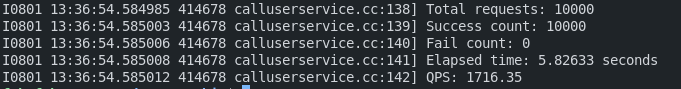
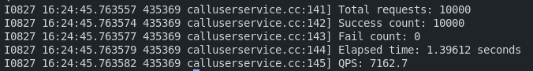
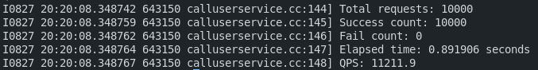

# 基于muduo和protobuf的RPC框架
本项目实现了一个基于 Muduo 网络库金和 Protobuf 序列化的高性能RPC框架，支持服务注册于发现、自动序列化、异步通信等特性。使用长连接、zookeeper连接池优化降低网络连接开销。

---
### 服务调用方

---

服务调用方通过 protobuf 自动生成的 stub 代理类进行远程调用。构造 stub 时传入 MpRpcChannel，设置好调用参数后，直接调用 stub 的方法即可。stub 方法内部会统一通过 MpRpcChannel 重写的 CallMethod 发起 RPC 请求。主要流程如下：

1. **构建请求数据包**  
   按照约定格式组织请求数据：[header_size（4字节）][数据头（service_name|method_name|args_size）][参数内容]。

2. **序列化参数与数据头**  
   对参数和数据头分别进行序列化，拼接成完整的请求消息。

3. **服务发现**  
   通过 service_name 和 method_name 从 ZooKeeper 查询对应服务的 IP 和端口。

4. **网络通信**  
   根据获取到的 IP 和端口建立 socket 连接，发送 RPC 调用请求，并阻塞等待服务端响应。

5. **结果处理**  
   接收服务端返回的数据，对结果进行反序列化，并将最终结果返回给调用者。

---

### 服务发布方

服务发布方负责将本地实现的服务通过 RPC 框架对外发布，使客户端能够远程调用。主要流程如下：

1. **服务实现与注册**  
   开发者实现具体的服务类（继承自 protobuf 自动生成的服务基类），并将其注册到 RpcProvider 中，完成服务与方法的本地映射。

2. **启动网络服务**  
   RpcProvider 启动 Muduo 网络服务器，设置连接和消息回调，监听指定端口，准备接收来自客户端的 RPC 请求。

3. **服务信息注册到 ZooKeeper**  
   启动时，RpcProvider 会将所有已注册的服务及其方法信息同步到 ZooKeeper。服务节点以永久节点形式创建，方法节点以临时节点形式创建，并在方法节点中记录当前服务提供者的 IP 和端口，便于客户端发现和路由。

4. **请求接收与处理**  
   当收到客户端的 RPC 调用请求后，RpcProvider 解析请求数据，查找本地映射表，定位到对应的服务和方法，并调用实际的业务逻辑。

5. **结果返回**  
   业务方法执行完成后，RpcProvider 将结果序列化，通过网络返回给客户端，完成一次完整的远程调用流程。

---
### RpcProvider


---

`RpcProvider` 是整个 RPC 框架的核心组件，主要职责如下：

1. **服务注册与管理**  
   接收服务发布方注册的服务对象，并将服务及其包含的方法信息维护在内部的映射表（map）中，便于后续查找和调用。

2. **服务发布与节点注册**  
   启动 Muduo 网络服务器，绑定连接和消息回调。同时，将已注册的服务及其方法信息同步到 ZooKeeper：服务节点作为永久节点创建，方法节点作为临时节点创建，并在方法节点中保存当前服务提供者的 IP 和端口，便于客户端服务发现和负载均衡。

3. **请求处理与方法分发**  
   在消息回调中，接收并解析 RPC 调用请求，通过反序列化获取请求头和参数。根据服务名和方法名在本地映射表中查找对应的服务和方法，查找到后为方法调用绑定回调函数（用于序列化响应并通过网络返回给调用方），最后通过 CallMethod 动态分发并执行实际的业务方法。

---

### 并发测试

用1000个线程，每个线程请求10次，并发测试结果如下：





1. 第一个图为短连接的情况下QPS，即每次RPC请求都需要进行建立连接->调用->断开连接，这增加了大量的开销；
2. 第二个图为长连接情况下QPS，相同线程调用后不会立即断开连接，下一次RPC请求仍会复用这次TCP连接。当stub对象被析构时才会断开连接。这种情况下QPS有相当大的提升。

问题： 在高并发时，会出现查找zookeeper节点失败情况导致无法获取服务方的IP和端口，这可能是zookeeper对高并发的能力有限。

优化：在高并发测试中，发现并发数到达一个数量后zookeeper会拒绝新的客户端连接，这是因为zookeeperd对每个IP最大允许并发连接数有限制，默认是60。查看代码：
```cpp
// mprpcchannel.cc:MprpcChannel::CallMethod
ZkClient zkCli;
zkCli.Start();
```
这里是每个线程请求rpc调用时都创建一个ZkClient对象，也就是建立对zookeeper服务器的一个连接。当进行高并发时，例如使用1000个线程或者更多线程进行请求时，可能会超过最大连接数限制，从而被zookeeper服务器拒绝连接。此外，建立连接的开销也是框架性能瓶颈之一。为此，采用zookeeper连接池解决此问题。每次连接时从zookeeper连接池取得一个连接，使用结束后归还给连接池。

```cpp
// ZkConnectionPool.h
class ZkConnectionPool
{
public:
    static ZkConnectionPool *getInstance();
    std::shared_ptr<ZkClient> getConnection();

private:
    ZkConnectionPool();
    ZkConnectionPool(const ZkConnectionPool &) = delete;
    ZkConnectionPool &operator=(const ZkConnectionPool &) = delete;

    bool loadConfig();
    void init(int initialSize);

    // 定义一个可复用的删除器（限定名称空间在连接池内）
    struct ZkClientDeleter
    {
        ZkConnectionPool *m_pool;
        void operator()(ZkClient *client) const;
    };

    int m_initialSize;
    std::queue<std::shared_ptr<ZkClient>> m_connectionQueue; // 定义时不需要声明删除器类型，在构造对象时将删除器实例作为参数传入
    std::mutex m_queueMutex;
    std::condition_variable m_cv;
};
```



上图是在TCP短连接情况下使用连接数为30的zookeeper连接池后的QPS，可以看出相较于之前1716的QPS翻了五倍！


总之，这个项目可以加强对RPC的理解，但用于生产环境远远不够...
gRPC永远的神！


### 更新

1. mprpcchannel增加了重连机制，即尝试连接服务方三次，如果三次都无法连接就表示这次调用失败。

2. 增加了对长连接的支持，相同线程可以复用建立的TCP连接，直至代理类析构时断开连接。

3. 增加zookeeper连接池，减少获取服务方ip和端口时与zookeeper服务器建立连接的开销

4. 新增一个分支，使用Boost.Asio代替muduo处理网络I/O，性能测试下来发现差不多。
   在使用Boost.Asio时，需注意长连接的情况下需要将缓冲区的数据全部读完。

整个项目体会最大的就是Protobuf对虚函数和继承的完美使用！多态的思想被充分地体现了....